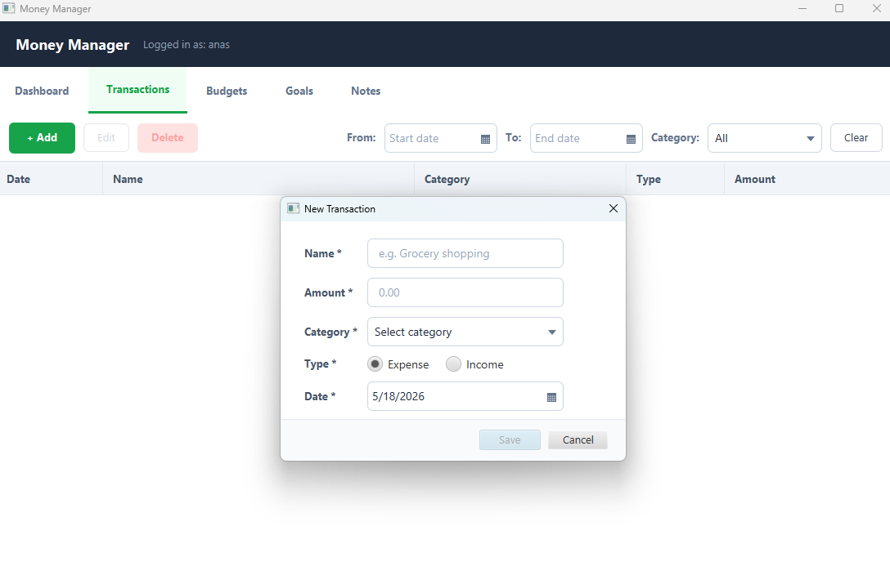
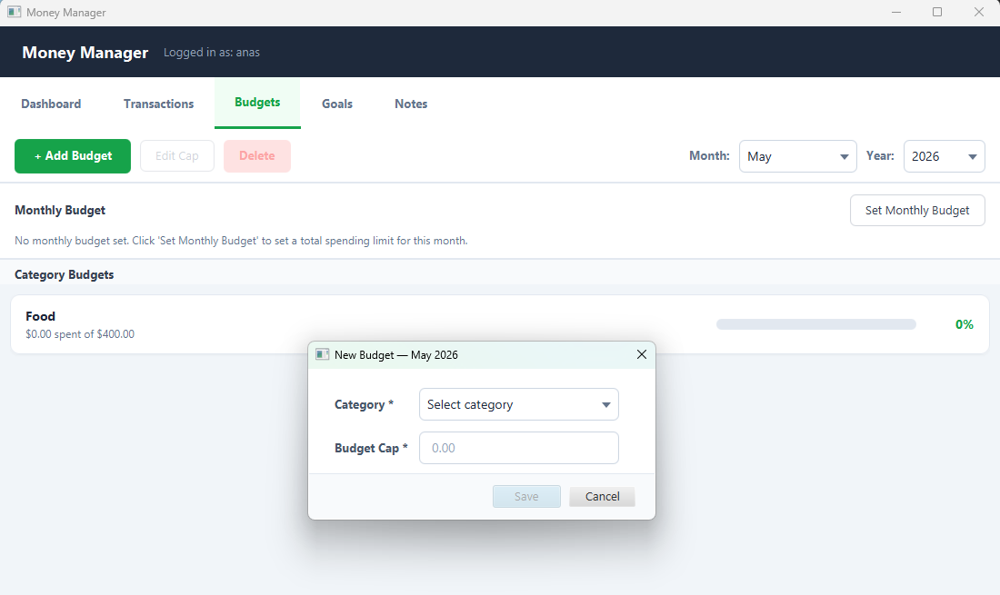
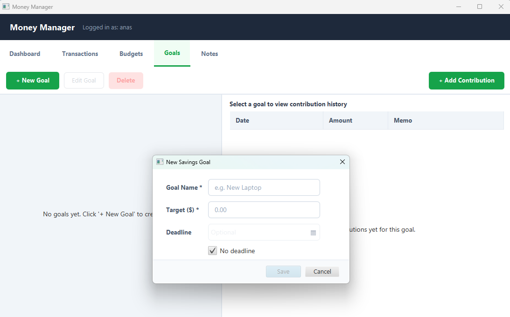

# 🖥️ Money Manager Desktop App
> Take control of your local finances. Secure, lightweight, and offline-first.

A modern, offline-first personal financial management application built in **Java 17** using **JavaFX** for the graphical user interface, **SQLite** for secure local storage, and structured with a strict **3-Tier Architecture** honoring all **SOLID principles**.

[](https://github.com/anasemadanas/Money_Manager)
[](https://github.com/anasemadanas/Money_Manager/blob/main/LICENSE)
[](https://www.oracle.com/java/)
[](https://openjfx.io/)
[](https://www.sqlite.org/)

---

## 📑 Table of Contents

- [🧾 Introduction](#-introduction)
- [✨ Features](#-features)
- [🖼️ Screenshots](#️-screenshots)
- [🧱 Architecture & SOLID Design](#-architecture--solid-design)
- [📂 Project Structure](#-project-structure)
- [📦 Requirements](#-requirements)
- [⚙️ Installation](#️-installation)
- [▶️ Run the App](#️-run-the-app)
- [🧪 Running Unit Tests](#-running-unit-tests)
- [🔮 Future Enhancements](#-future-enhancements)
- [📝 License](#-license)
- [🔗 Contact](#-contact)

---

## 🧾 Introduction

**Money Manager Desktop** is designed for users who want immediate, secure, and fully private financial tracking on their computer. There are no cloud dependencies; all of your financial records remain completely local inside an encrypted or lightweight SQLite database.

Built using the finest software engineering practices:

| Technology | Purpose |
| :--- | :--- |
| **Java 17 LTS** | Core programming language |
| **JavaFX 21** | Native desktop UI controls, charts, and styling |
| **SQLite JDBC** | High-performance local SQL database engine |
| **BCrypt** | Secure password hashing for user profiles |
| **3-Tier Architecture** | Separation of Presentation, Service, and Repository layers |
| **Maven** | Dependency management and build shaded-packaging |

---

## ✨ Features

- 🔐 **Multi-Profile Authentication**: Secure login and registration. Includes a security question reset mechanism for safety.
- 💸 **Transaction Manager**: Full CRUD actions for tracking income and expenses categorized in clean tables.
- 📊 **Insightful Dashboard**: Top-level financial indicators (Income, Expense, Net) accompanied by interactive pie and monthly trend charts.
- 📅 **Budget Planner**: Establish target thresholds per category. The UI will show custom progress indicators warning at 80% (amber) and alert at 100% (red).
- 🎯 **Savings Tracker**: Plan long-term milestones. Add contributions and see the system dynamically evaluate progress against target deadlines.
- 📝 **Financial Notes**: Embedded text utility to draft notes, track spending habits, or save lists.
- 🛡️ **Validation Safeguards**: Business-tier validation to protect you from entering negative amounts, invalid dates, or exceeding budget warnings.

---

## 🖼️ Screenshots

| Login | Dashboard | Transaction | Budget | Goal | ListTransaction |
|:---:|:---:|:---:|:---:|:---:|:---:|
|  |  |  |  |  |  |

> 💡 *Note: If screenshots are not showing, verify they are stored inside the `docs/screenshots/` workspace folder.*

---

## 🧱 Architecture & SOLID Design

```
┌─────────────────────────────────────────┐
│            PRESENTATION LAYER           │  ← JavaFX FXML, Style.css, Controllers
│  - Captures UI events. No logic here.   │
└────────────────────┬────────────────────┘
                     │ calls (DTOs)
┌────────────────────▼────────────────────┐
│            BUSINESS SERVICE             │  ← AuthService, BudgetService, etc.
│  - Validation, mathematical formulas.   │
└────────────────────┬────────────────────┘
                     │ calls (interfaces)
┌────────────────────▼────────────────────┐
│            REPOSITORY LAYER             │  ← IUserRepo, ITransactionRepo, etc.
│  - Raw SQLite SQL commands.             │
└────────────────────┬────────────────────┘
                     │
             SQLite Database
```

### SOLID Principles Compliance
- **S (Single Responsibility)**: Services handle logic, controllers handle presentation, repositories handle database access.
- **O (Open/Closed)**: New repository storage mechanisms (e.g., File, JPA) can be added without modifying existing code.
- **L (Liskov Substitution)**: Any subclass implementation of database access is transparently interchangeable.
- **I (Interface Segregation)**: Repository interfaces are granularly defined per model (`ITransactionRepo`, `IBudgetRepo`).
- **D (Dependency Inversion)**: Controllers depend on service interfaces; services depend on repository interfaces. Wired via constructors.

---

## 📂 Project Structure

```bash
money-manager
├─ pom.xml                  # Maven packaging & dependency configurations
├─ schema sqlite.sql        # Database initialization DDL for tables & indexes
├─ src
│  ├─ main
│  │  ├─ java
│  │  │  └─ com
│  │  │     └─ moneymanager
│  │  │        ├─ App.java             # Main Application entry point
│  │  │        ├─ Launcher.java        # Shade-friendly non-modular starter
│  │  │        ├─ config/              # Database connections & property loaders
│  │  │        ├─ dto/                 # Light data objects (records)
│  │  │        ├─ model/               # Core domain objects
│  │  │        ├─ repository/          # SQLite repos & interfaces
│  │  │        ├─ service/             # Validation & Business calculations
│  │  │        └─ ui/                  # JavaFX Controllers & utilities
│  │  └─ resources
│  │     ├─ db.properties              # Local database URL settings
│  │     ├─ css/                       # style.css for JavaFX skinning
│  │     └─ fxml/                      # Views definitions
│  └─ test
│     └─ java
│        └─ com
│           └─ moneymanager            # Unit tests for repositories & services
```

---

## 📦 Requirements

- **Java JDK**: Version 17 LTS installed.
- **Maven**: Version 3.9+ (or use `./mvnw` wrapper).
- **Operating System**: Windows, macOS, or Linux.
- **SQLite**: No engine installation is required (SQLite is self-contained and run locally through JDBC).

---

## ⚙️ Installation

```bash
# 1. Clone the repository (if not already done)
git clone https://github.com/anasemadanas/Money_Manager.git

# 2. Navigate to the desktop module
cd Money_Manager/money-manager

# 3. Compile the project
mvn clean compile
```

---

## ▶️ Run the App

### 1. Launch via Maven
```bash
mvn javafx:run
```

### 2. Package into a Shaded (Fat) JAR
You can package the entire application into a single executable JAR:
```bash
mvn clean package
```
After packaging, you can find the executable JAR inside the `target/` directory and execute it using:
```bash
java -jar target/money-manager-1.0.0.jar
```

---

## 🧪 Running Unit Tests

Unit tests are written using **JUnit 5** to test logic inside services:
```bash
mvn test
```

---

## 🔮 Future Enhancements

- 🔑 **Encrypted SQLite Database**: Upgrade to SQLCipher to encrypt user details on the hard drive.
- 🎨 **Modern Themes**: Include dark-mode toggles and customized HSL palettes.
- 📊 **Visual Exports**: Allow users to generate PDF and Excel charts directly from the dashboard.

---

## 📝 License

Distributed under the MIT License. See [LICENSE](../LICENSE) for more details.

---

## 🔗 Contact

| Platform | Link |
|:---|:---|
| 🐙 GitHub | [anasemadanas](https://github.com/anasemadanas/) |
| 💼 LinkedIn | [Anas Emad](https://www.linkedin.com/in/eng-anasemad/) |
| 📧 Email | [anaspython3@gmail.com](mailto:anaspython3@gmail.com) |

[↩️ Back to Table of Contents](#-table-of-contents)
