# 💰 Money Manager Suite
> Organize your finances. Track your money. Plan smarter.

A modern, highly-scalable personal finance management suite built in **Java** utilizing a clean **3-Tier Architecture** and strict adherence to **SOLID principles**. The suite offers a polished **Desktop Client** (built with JavaFX and SQLite), a robust **Web Application** (built with Spring Boot, Thymeleaf, and PostgreSQL), and a native offline **Android App** for mobile access.

[](https://github.com/anasemadanas/Money_Manager)
[](https://github.com/anasemadanas/Money_Manager)
[](https://github.com/anasemadanas/Money_Manager/issues)
[](https://github.com/anasemadanas/Money_Manager)
[](https://github.com/anasemadanas/Money_Manager)
[](https://github.com/anasemadanas/Money_Manager/blob/main/LICENSE)
[](https://www.oracle.com/java/)
[](https://spring.io/projects/spring-boot)
[](https://openjfx.io/)

---

## 📑 Table of Contents

- [🧾 Introduction](#-introduction)
- [📦 Suite Sub-Modules](#-suite-sub-modules)
- [✨ Core Features](#-core-features)
- [🖼️ Screenshots](#-screenshots)
- [🧱 System Architecture](#-system-architecture)
- [📐 Design Diagrams](#-design-diagrams)
- [📂 Project Layout](#-project-layout)
- [⚙️ Global Requirements](#-global-requirements)
- [🚀 Getting Started](#-getting-started)
- [🙌 How to Contribute](#-how-to-contribute)
- [🔮 Future Enhancements](#-future-enhancements)
- [📝 License](#-license)
- [🔗 Contact](#-contact)

---

## 🧾 Introduction

**Money Manager Suite** is an advanced financial tracking solution designed to give users complete control over their personal finances. By combining clean presentation layers with a powerful, modular backend service layer, the suite guarantees data consistency, security, and a high-performance experience across platforms.

Whether you prefer a lightweight, local-first **Desktop Application**, a connected **Web Application**, or a mobile wrapper for the hosted service, this repository provides an appropriate client.

### Core Architecture Highlights
- **SOLID Principles**: Strongly separated responsibilities, making features modular, reusable, and easy to test.
- **Repository Pattern**: Abstracted database layers allowing swappable data sources (SQLite / PostgreSQL).
- **3-Tier Architecture**: Absolute decoupling of the Presentation Layer, Business Logic Layer, and Data Access Layer.

---

## 📦 Suite Sub-Modules

The workspace consists of three applications: independent desktop, web, and offline Android implementations:

| Sub-Module | Technology Stack | Primary Purpose | README Link |
| :--- | :--- | :--- | :--- |
| **🖥️ Money Manager Desktop** | Java 17, JavaFX 21, SQLite | A fast, offline-first local desktop client with interactive charts and alerts. | [Desktop README](money-manager/README.md) |
| **🌐 Money Manager Web** | Java 26, Spring Boot 4.0.6, Thymeleaf, PostgreSQL | A responsive web app providing centralized database access and multi-device support. | [Web README](money-manager-web/README.md) |
| **Money Manager Android** | Java 17, Android SDK 35, SQLite, Gradle | A native offline mobile ledger with on-device storage. | [Android README](android-app/README.md) |

---

## ✨ Core Features

- 🔑 **Secure Authentication**: Register and login screens with passwords safely hashed using **BCrypt**.
- 📊 **Dynamic Dashboard**: Interactive KPI metrics (Total Income, Total Expenses, Net Balance) alongside visual spend distribution charts.
- 💸 **Transaction CRUD**: Record, view, edit, and delete income/expenses with category tags and transaction dates.
- 📅 **Smart Budgets**: Establish category-specific monthly spending limits with color-coded warning bars (amber at 80%, red at 100%).
- 🎯 **Savings Goals**: Set up custom target funds (e.g., "New Laptop") with deadlines, manual progress contributions, and timeline status calculations.
- 📝 **Financial Notes**: Simple markdown-style note editor to jot down financial observations, strategies, or reminders.
- 🚫 **Expense Validation**: In-service checks preventing expenses from exceeding defined monthly balances or category caps.

---

## 🖼️ Screenshots

| Login | Dashboard |
| :---: | :---: |
| 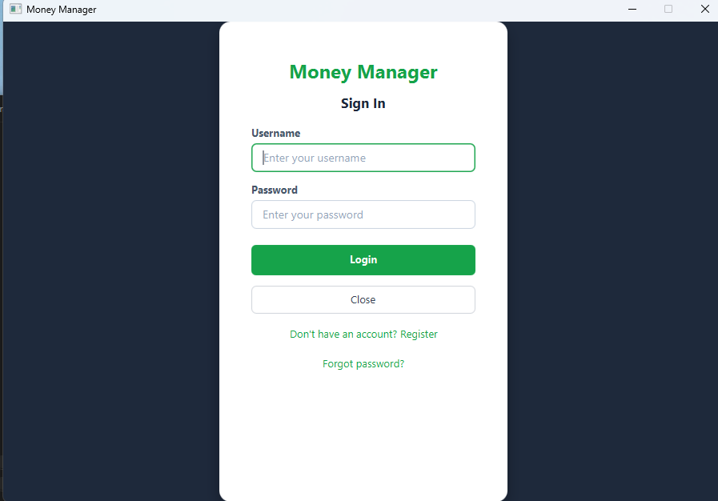 | 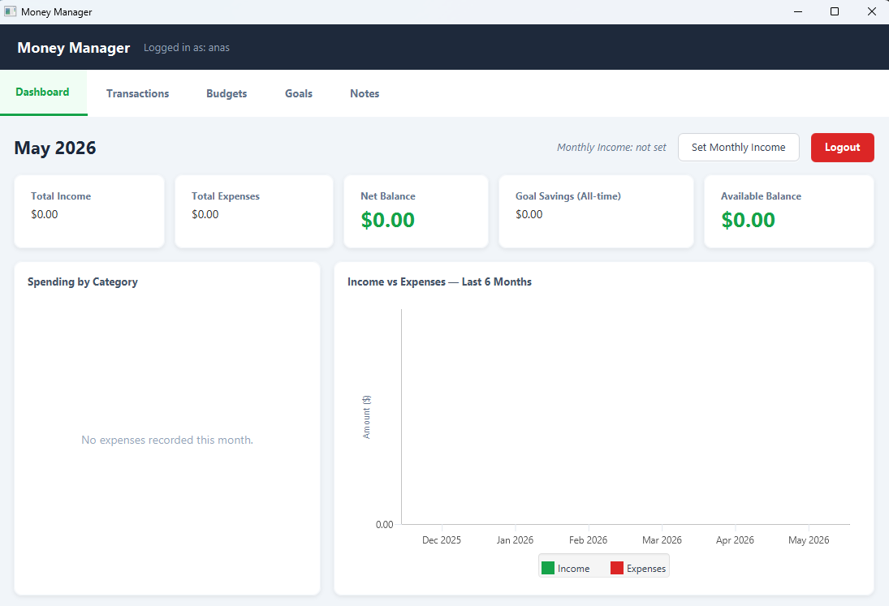 |
| **Transactions** | **Budgets** |
|  |  |
| **Savings Goals** | **Notes** |
|  | 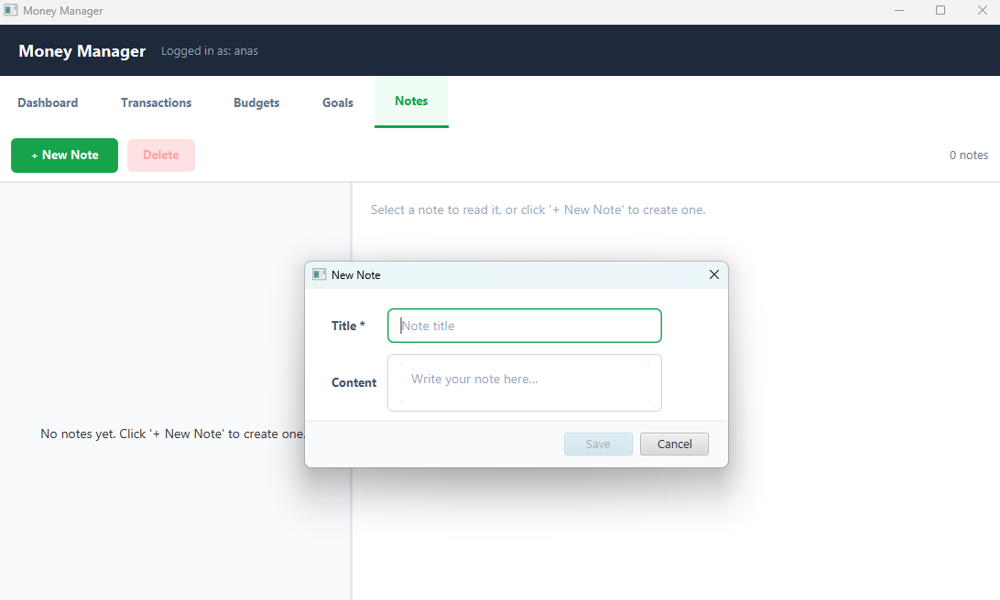 |

---

## 🧱 System Architecture

The following diagram illustrates how the modular layers are organized across both projects:

```
                  ┌─────────────────────────────────────────┐
                  │            PRESENTATION LAYER           │
                  │  (JavaFX Desktop FXML  /  Thymeleaf Web)│
                  └────────────────────┬────────────────────┘
                                       │ Calls (DTOs)
                  ┌────────────────────▼────────────────────┐
                  │           BUSINESS LOGIC LAYER          │
                  │   (Auth, Transaction, Budget Services)  │
                  └────────────────────┬────────────────────┘
                                       │ Abstractions (Interfaces)
                  ┌────────────────────▼────────────────────┐
                  │             REPOSITORY LAYER            │
                  │    (JdbcTransactionRepo, JdbcUserRepo)  │
                  └───────────┬─────────────────┬───────────┘
                              │                 │
                      (SQLite JDBC)       (Postgres Driver)
                              │                 │
                      ┌───────▼───────┐ ┌───────▼───────┐
                      │ Desktop Local │ │   Web Server  │
                      │  SQLite DB    │ │  Postgres DB  │
                      └───────────────┘ └───────────────┘
```

---

## 📐 Design Diagrams

| Application Overview | Use Case Diagram |
| :---: | :---: |
| 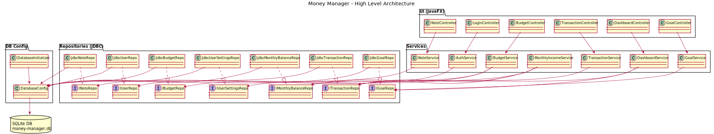 | 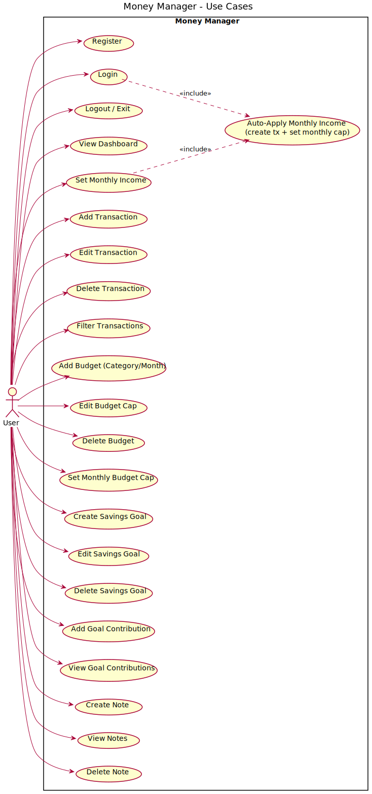 |
| **Class Diagram** | **Database Schema** |
| 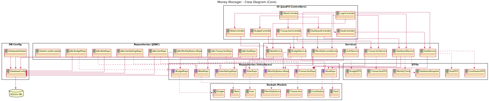 | 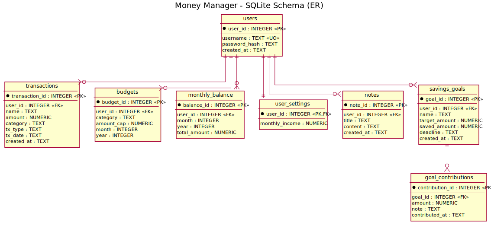 |
| **ER Diagram** | **EER Diagram** |
| 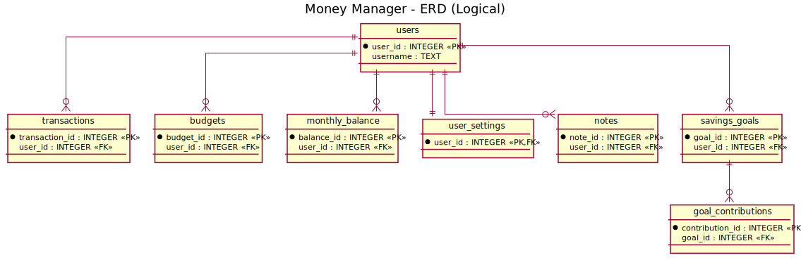 | 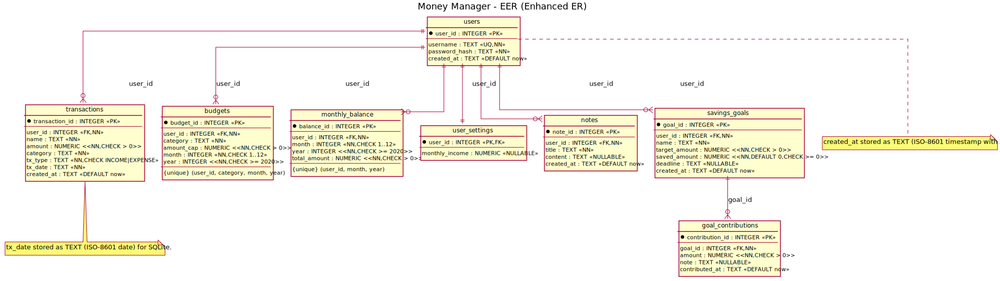 |
| **Login to Dashboard Sequence** | **Add Expense Sequence** |
| 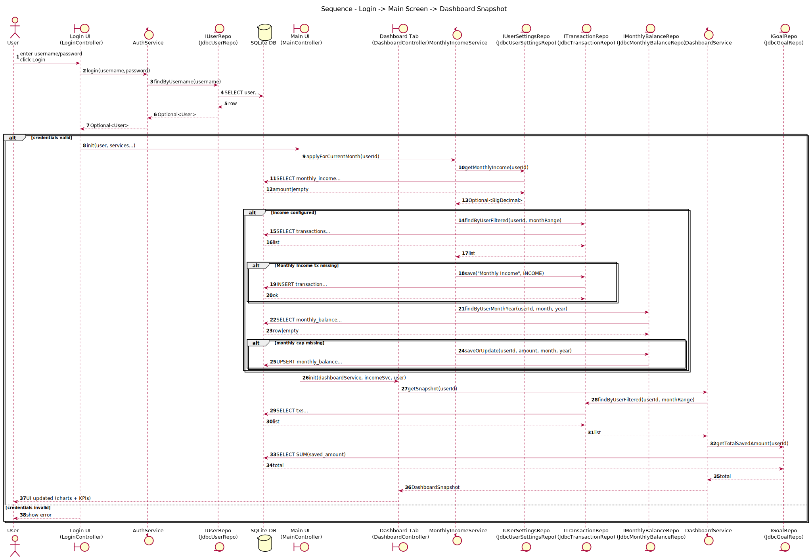 |  |

### Add Expense Activity Flow

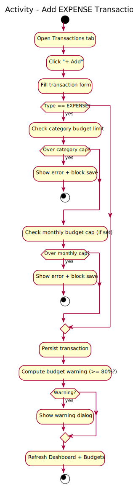

---

## 📂 Project Layout

```bash
Money_Manager
├─ .gitignore              # Global git exclusions
├─ LICENSE                 # MIT License details
├─ README.md               # Main suite documentation (this file)
├─ money-manager           # 🖥️ JavaFX Desktop Client Project
│  ├─ pom.xml              # Desktop Maven configuration
│  ├─ schema sqlite.sql    # SQLite database schema initialization
│  └─ src/                 # JavaFX source files
├─ money-manager-web       # 🌐 Spring Boot Web Application
│  ├─ pom.xml              # Web Maven configuration
│  ├─ src/                 # Spring Boot source files & Thymeleaf templates
│  └─ run.bat              # Script to build & execute web app locally
├─ android-app             # Native offline Android application
│  ├─ build.gradle         # Android Gradle configuration
│  └─ app/                 # Android application source and resources
├─ docs/                   # SRS documents and PlantUML sources
└─ screenshots/            # UI screenshots and exported SVG diagrams
```

---

## ⚙️ Global Requirements

- **Java Development Kit (JDK)**: JDK 17+ installed (JDK 26 required to run/build the web module).
- **Apache Maven**: Version 3.9+ (or use the included `mvnw` wrappers).
- **PostgreSQL 16+**: Only needed for running the Web sub-module.
- **SQLite**: Automatic local creation for the Desktop sub-module (no setup required).
- **Android SDK API 35**: Only needed for building the offline Android app.

---

## 🚀 Getting Started

To get the entire suite up and running, follow these steps:

### 1. Clone the Repository
```bash
git clone https://github.com/anasemadanas/Money_Manager.git
cd Money_Manager
```

### 2. Set Up the Desktop Client
Navigate to the `money-manager` folder and compile/run the application:
```bash
cd money-manager
mvn clean compile
mvn javafx:run
```
> 📘 *For more detailed settings, database customization, and packaging instructions, read the [Desktop Module README](money-manager/README.md).*

### 3. Set Up the Web Application
Navigate to the `money-manager-web` folder, configure your database details in `src/main/resources/db.properties`, and start the dev server:
```bash
cd ../money-manager-web
mvn clean spring-boot:run
```
> 🌐 *For template designs, controller logic, and deployment scripts, read the [Web Module README](money-manager-web/README.md).*

### 4. Build the Offline Android App
From the web module used in the previous step, move to the Android project and build a debug APK with the included Gradle Wrapper:
```powershell
cd ..\android-app
.\gradlew.bat assembleDebug
```
> *For app behavior and output details, read the [Android Module README](android-app/README.md).*

---

## 🙌 How to Contribute

Contributions are welcome and highly appreciated! Please follow these guidelines:

1. **Fork** the repository.
2. **Create** your feature branch: `git checkout -b feature/amazing-feature`.
3. **Commit** your changes with descriptive descriptions: `git commit -m "Add: interactive transaction search"`.
4. **Push** to the branch: `git push origin feature/amazing-feature`.
5. **Submit** a Pull Request.

---

## 🔮 Future Enhancements

- 📊 **Advanced Analytics**: Add monthly PDF report generators and CSV exports.
- 📱 **Mobile Synchronizer**: Add optional encrypted backup and synchronization for offline mobile data.
- ☁️ **Hybrid Sync**: Enable optional cloud backup from the local SQLite desktop client to the Web Server PostgreSQL instance.
- 🤖 **AI Financial Coach**: Implement localized LLM insights to evaluate budget efficiency and spending trends.

---

## 📝 License

Distributed under the MIT License. See [LICENSE](LICENSE) for more information.

---

## 🔗 Contact

| Platform | Link |
|:---|:---|
| 🐙 GitHub | [anasemadanas](https://github.com/anasemadanas/) |
| 💼 LinkedIn | [Anas Emad](https://www.linkedin.com/in/eng-anasemad/) |
| 📧 Email | [anaspython3@gmail.com](mailto:anaspython3@gmail.com) |

[↩️ Back to Table of Contents](#-table-of-contents)
